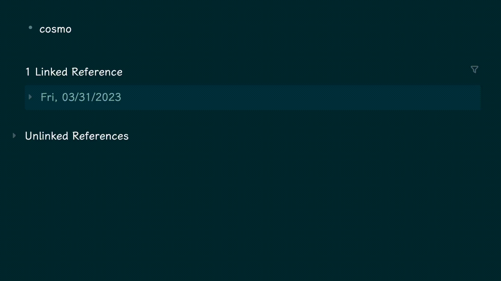

# logseq-oxford-dictionary plugin

这个项目的功能是从网页解析Oxford Dictionary中的单词释义和例句。

目前由于CORS问题，需要本地搭建一个代理访问Oxford Dictionary才能使用

`proxy.py` 通过fastapi进行代理

## TODO

- [x] 支持一词多词性查询，同时返回
- [x] 查询失败处理
- [ ] 代码优化（第一次写typescript，写的太糟糕了）
- [ ] 输出格式添加高亮等优化
- [ ] 寻找一种不需要使用代理的方法

## Usage

